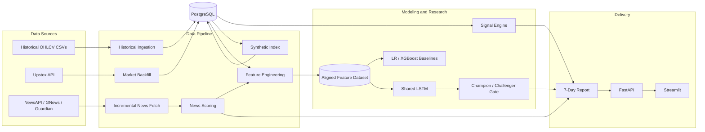
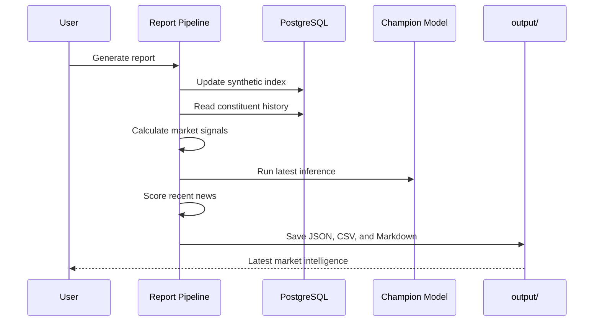

<div align="center">

# Nifty 50 Market Intelligence

### Multi-stock deep learning, news sentiment, and market-signal research

An end-to-end quantitative research platform for classifying short-horizon
movements in a weighted Nifty 50 constituent basket.

[](https://www.python.org/)
[](https://pytorch.org/)
[](https://www.postgresql.org/)
[](https://fastapi.tiangolo.com/)
[](https://streamlit.io/)
[](https://www.docker.com/)

</div>

---

| Research Universe | Model Input | Champion ROC-AUC | Baseline Lift |
| :---: | :---: | :---: | :---: |
| **50 stocks** | **48 x 5-minute bars** | **0.6372** | **+0.1373 vs XGBoost** |

| Feature Space | Market History | Latest Inference Data | Model Governance |
| :---: | :---: | :---: | :---: |
| **421 features** | **2017-2026** | **June 9, 2026** | **Champion / Challenger** |

> **Research scope:** This project evaluates predictive signal quality. It does
> not model complete execution costs and should not be interpreted as financial
> advice or deployable trading alpha.

**Navigate:** [Architecture](#architecture) | [Research Target](#research-target)
| [Model Performance](#model-performance) | [Quick Start](#quick-start) |
[API](#api) | [Project Structure](#project-structure)

## What This Project Demonstrates

| Capability | Implementation |
| --- | --- |
| **Market-data engineering** | Historical ingestion, Upstox backfill, 1-minute to 5-minute resampling, duplicate-safe PostgreSQL writes |
| **Quantitative features** | Price action, volume pressure, constituent alignment, weighted basket construction, and news context |
| **Deep learning** | Shared PyTorch LSTM across 50 stocks with index-weighted aggregation |
| **Model validation** | Chronological split, train-only normalization, class-aware loss, and three baseline comparisons |
| **Model governance** | Versioned champion/challenger artifacts with metric-based promotion |
| **Delivery** | FastAPI endpoints, Streamlit research dashboard, reports, Docker Compose, and scheduled news collection |

## Dashboard Preview

### Model Performance

The research dashboard presents the protected champion metrics and compares the
LSTM against simple tabular baselines.

<p align="center">
  
</p>

<table>
  <tr>
    <td width="50%" align="center">
      <strong>News Sentiment Analysis</strong>
    </td>
    <td width="50%" align="center">
      <strong>7-Day Trading Report</strong>
    </td>
  </tr>
  <tr>
    <td>
      
    </td>
    <td>
      
    </td>
  </tr>
  <tr>
    <td>
      Historical news coverage, monthly sentiment, and engineered NLP features.
    </td>
    <td>
      Recent market freshness, article activity, and daily FinBERT sentiment.
    </td>
  </tr>
</table>

## Architecture



## Research Target

The current model is a binary classifier:

> Will the weighted Nifty 50 constituent basket rise by more than **0.1% during
> the next 30 minutes**?

Each sequence contains 48 five-minute bars across 50 stocks. The shared LSTM
encodes each constituent using eight price/volume features, combines stock
representations using configured index weights, and joins them with global
market and news features.

## Model Performance

The following values come from the protected full-run champion artifact in
`output/models/nifty50_lstm_metrics.json`.

| Metric | Champion |
| --- | ---: |
| ROC-AUC | **0.6372** |
| Accuracy | 68.55% |
| F1 score | 0.3568 |
| Positive-class precision | 32.02% |
| Positive-class recall | 40.30% |
| Training sequences | 136,891 |
| Evaluation sequences | 34,186 |
| Features | 421 |
| Sequence length | 48 bars |

### Baseline Comparison

| Model | ROC-AUC |
| --- | ---: |
| Majority classifier | 0.5000 |
| Logistic regression | 0.5218 |
| XGBoost, global features only | 0.4999 |
| **Shared LSTM** | **0.6372** |

The LSTM produces a `+0.1373` ROC-AUC lift over the saved XGBoost baseline.
Accuracy is not treated as the main result because the positive class is
imbalanced.

### Evaluation Window

| Partition | Period |
| --- | --- |
| Training | November 17, 2017 to January 24, 2024 |
| Evaluation | January 24, 2024 to August 6, 2025 |
| Latest saved inference data | June 9, 2026 |

The split is chronological, normalization is fitted on the training partition,
and targets are shifted after splitting to reduce future leakage. The
evaluation partition is also used for early stopping, so these results should
be interpreted as validation evidence rather than a final untouched test.

### Champion/Challenger Protection

New training runs do not overwrite the current champion automatically:

```bash
python -m src.modeling --challenger
```

A challenger is promoted only when:

- ROC-AUC strictly improves;
- F1 does not decline; and
- lift over XGBoost remains positive.

The latest challenger used data through June 9, 2026. It achieved ROC-AUC
`0.6365` and F1 `0.3610`; it was rejected because it did not beat the champion
ROC-AUC of `0.6372`.

### Research Limitations

- The current constituent universe introduces survivorship bias.
- Walk-forward and purged cross-validation are not yet implemented.
- Early stopping uses the evaluation partition.
- Brokerage, spread, slippage, turnover, and market impact are not modeled.
- Classification performance does not establish profitable or deployable alpha.

## Report Workflow



## Technology

| Area | Tools |
| --- | --- |
| Language | Python 3.11 |
| Data | pandas, NumPy, PyArrow |
| Modeling | PyTorch, scikit-learn, XGBoost |
| NLP | Transformers / FinBERT |
| Database | PostgreSQL 15, SQLAlchemy, psycopg2 |
| Services | FastAPI, Uvicorn, Streamlit |
| Operations | Docker, Docker Compose, GitHub Actions |
| Testing | pytest |

## Quick Start

### Docker

Create the environment file:

```bash
cp .env.example .env
```

Configure at least:

```env
NIFTY_API_KEY=replace-with-a-strong-random-key

DB_HOST=localhost
DB_PORT=5432
DB_NAME=nifty50
DB_USER=postgres
DB_PASSWORD=replace-with-a-strong-password

DATA_FOLDER=/app/archive/*_minute.csv
UPSTOX_ACCESS_TOKEN=
NEWSAPI_KEY=
GNEWS_KEY=
GUARDIAN_KEY=
```

Start PostgreSQL, FastAPI, and Streamlit:

```bash
docker compose up --build
```

| Service | Address |
| --- | --- |
| FastAPI | http://localhost:8000 |
| OpenAPI documentation | http://localhost:8000/docs |
| Streamlit | http://localhost:8501 |
| PostgreSQL | `localhost:5432` |

### Local Development

Requirements:

- Python 3.11+
- PostgreSQL 15+
- Historical market files under `archive/`

```powershell
python -m venv venv
.\venv\Scripts\Activate.ps1
pip install -r requirements.txt
```

Create `.env`, then apply the SQL scripts in order:

```text
sql/01_schema.sql
sql/02_transformation.sql
sql/03_cleaning_and_optimization.sql
```

Load historical data:

```bash
python ingest_data.py
```

## Common Commands

```bash
# Backfill recent market candles
python -m src.backfill

# Build the synthetic index and signals
python -m src.synthetic_index
python -m src.signals

# Train a protected challenger
python -m src.modeling --challenger

# Run inference using the saved dataset
python live_inference.py --use-saved-dataset

# Generate all report artifacts
python generate_7day_report.py

# Start the API
uvicorn api:app --reload --port 8000

# Start the research dashboard
streamlit run src/dashboard.py
```

The Docker frontend currently runs `streamlit_app.py`, the API-connected report
viewer. `src/dashboard.py` is the standalone research and model-performance
dashboard.

## API

| Method | Endpoint | Authentication | Description |
| --- | --- | --- | --- |
| `GET` | `/` | None | Health status |
| `POST` | `/generate` | `X-API-Key` | Start report generation |
| `GET` | `/report/markdown` | None | Return the latest Markdown report |
| `GET` | `/report/data` | None | Return model, signal, and news artifacts |

```bash
curl -X POST http://localhost:8000/generate \
  -H "X-API-Key: your-api-key"
```

PostgreSQL advisory locking prevents concurrent report-generation jobs. A
second request receives HTTP `409`.

## Generated Artifacts

```text
output/
|-- modeling/
|   |-- nifty50_wide_dataset.parquet
|   `-- nifty50_wide_dataset_summary.json
|-- models/
|   |-- nifty50_lstm_state.pt
|   |-- nifty50_lstm_metadata.json
|   |-- nifty50_lstm_metrics.json
|   |-- nifty50_lstm_latest_prediction.json
|   |-- champions/
|   `-- challengers/
|-- news/
|   |-- latest_news_scored.csv
|   `-- latest_news_summary.json
|-- signals/
|   `-- latest_signals.json
`-- reports/
    `-- nifty50_7day_report.md
```

Generated data and model artifacts are excluded from Git because they can be
large and environment-specific.

## Project Structure

```text
nifty-50-50/
|-- api.py
|-- fetch_incremental.py
|-- generate_7day_report.py
|-- ingest_data.py
|-- live_inference.py
|-- streamlit_app.py
|-- config.yaml
|-- src/
|   |-- backfill.py
|   |-- dashboard.py
|   |-- database_manager.py
|   |-- feature_engineering.py
|   |-- modeling.py
|   |-- news_processor.py
|   |-- report_agent.py
|   |-- settings.py
|   |-- signals.py
|   |-- synthetic_index.py
|   `-- update_nifty50_weights.py
|-- notebooks/
|   |-- backfilling_data.ipynb
|   |-- decision_log.ipynb
|   |-- news.ipynb
|   `-- nifty50 - 50.ipynb
|-- sql/
|-- tests/
|-- archive/
|-- news_data/
`-- output/
```

## Testing

```bash
pytest -q
```

Tests cover backfill parsing and chunking, news timing, sequence construction,
model gradients, signal generation, and concurrent report locking.

## Configuration and Automation

- Secrets are loaded from `.env`; non-secret behavior is configured in
  `config.yaml`.
- `DATABASE_URI` can replace individual database environment variables.
- `USE_FINBERT=true` enables transformer sentiment when the model is available.
- GitHub Actions schedules incremental news collection during Indian market
  hours. This updates news data; it does not deploy the dashboard.
- Model and dataset generation can be expensive. Use `dev_mode` only for quick
  pipeline checks, not for reporting final model performance.

## Security

Never commit `.env`, API keys, access tokens, passwords, raw market archives, or
model artifacts. Revoke and rotate any credential that has previously appeared
in a committed file or shared audit output.

## License

See [LICENSE](LICENSE).
